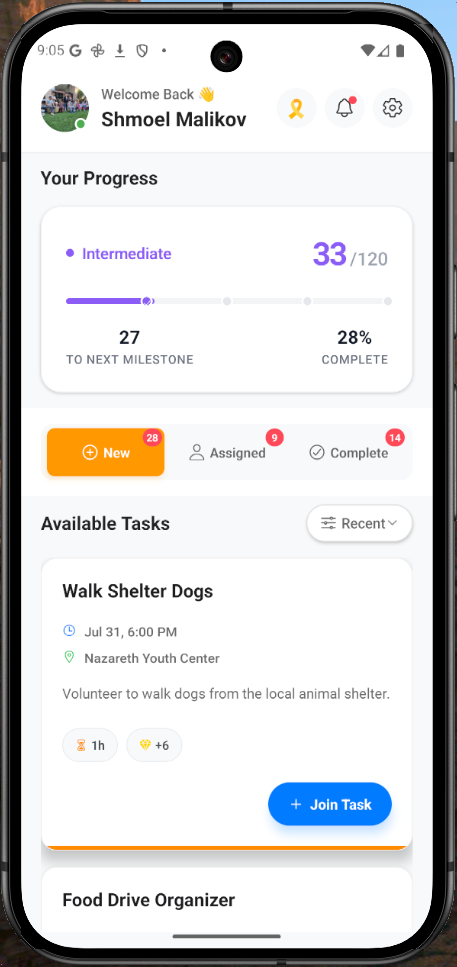
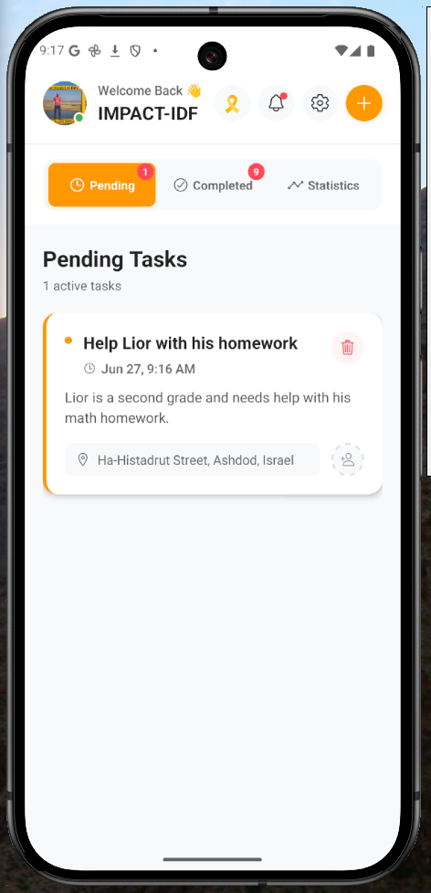

# Studo Development App 📱

A modern cross-platform mobile application built with Expo and React Native, designed for task management and social collaboration. Our platform enables users to connect, collaborate, and complete tasks efficiently through an intuitive interface.

<GooglePlacesAutocomplete
// ...other props...
textInputProps={{
    onFocus: () => {}, // Provide a default no-op if you don't need custom logic
    onBlur: () => {},
    // ...other props
  }}
/>

## Features ✨

- Social authentication with multiple providers
- Cross-platform compatibility (iOS, Android, Web)
- Real-time task management
- Location-based features
- User collaboration tools
- File-based routing architecture
- MongoDB integration
- TypeScript support

## Prerequisites 🛠️

Before you begin, ensure you have the following installed:

- Node.js (v16.0 or later)
- npm or yarn
- Xcode (for iOS development)
- Android Studio (for Android development)
- Expo Go app (for physical device testing)

## Installation 🚀

1. **Clone the repository**

   ```bash
   git clone https://github.com/yourusername/studo-app.git
   cd studo-app
   ```

2. **Install dependencies**

   ```bash
   npm install
   ```

3. **Set up environment variables**
   Create a `.env` file in the root directory:
   ```bash
   EXPO_PUBLIC_API_URL=your_api_url
   CLERK_PUBLISHABLE_KEY=your_clerk_key
   MONGODB_URI=your_mongodb_uri
   ```

## Running the App 📱

1. **Start the development server**

   ```bash
   npx expo start
   ```

2. **Choose your platform**
   - Press `i` to run on iOS simulator
   - Press `a` to run on Android emulator
   - Press `w` to run in web browser
   - Scan QR code with Expo Go app on your device

## Project Structure 📁

```
studo-app/
├── app/                # Main application code
│   ├── (tabs)/        # Tab-based navigation
│   ├── auth/          # Authentication screens
│   └── _layout.tsx    # Root layout configuration
├── components/        # Reusable UI components
├── server/           # Backend integration
├── types/            # TypeScript definitions
└── assets/          # Images, fonts, and other static files
```

## Development Guide 💻

### Fresh Project Setup

To start with a clean slate:

```bash
npm run reset-project
```

### Key Commands

```bash
npm start              # Start development server
npm run ios           # Run on iOS simulator
npm run android       # Run on Android emulator
npm run web           # Run in web browser
npm run test          # Run tests
```

## Tech Stack 🛠️

- **Frontend**

  - Expo
  - React Native
  - TypeScript
  - React Navigation

- **Backend**

  - MongoDB
  - Node.js
  - Express

- **Authentication**
  - Clerk

## Documentation 📚

For detailed documentation, please refer to:

- [Expo Documentation](https://docs.expo.dev/)
- [React Native Documentation](https://reactnative.dev/)
- [Clerk Documentation](https://clerk.dev/docs)
- [MongoDB Documentation](https://docs.mongodb.com/)

## Contributing 🤝

1. Fork the repository
2. Create your feature branch
   ```bash
   git checkout -b feature/YourFeature
   ```
3. Commit your changes
   ```bash
   git commit -m 'Add YourFeature'
   ```
4. Push to the branch
   ```bash
   git push origin feature/YourFeature
   ```
5. Open a Pull Request

## Support 💬

- Join our [Discord community](https://chat.expo.dev)
- Report issues on [GitHub Issues](https://github.com/yourusername/studo-app/issues)
- Check our [Documentation](https://docs.expo.dev/)

## License 📄

This project is licensed under the MIT License - see the [LICENSE](LICENSE) file for details.

## Acknowledgments 👏

- Expo team for the amazing development platform
- React Native community for continuous support
- All contributors who help improve this project

---

Built by Studo Development Team

## 📸 App Screenshots

### Logo of the application


### Login Page


### Student Feed



### Organization Feed


